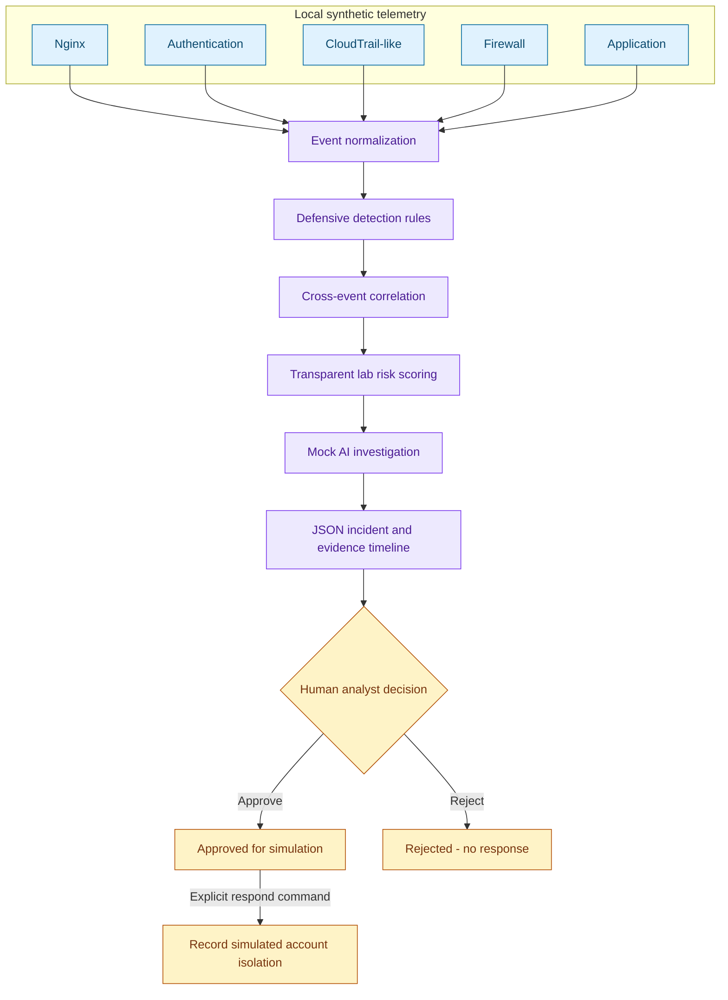
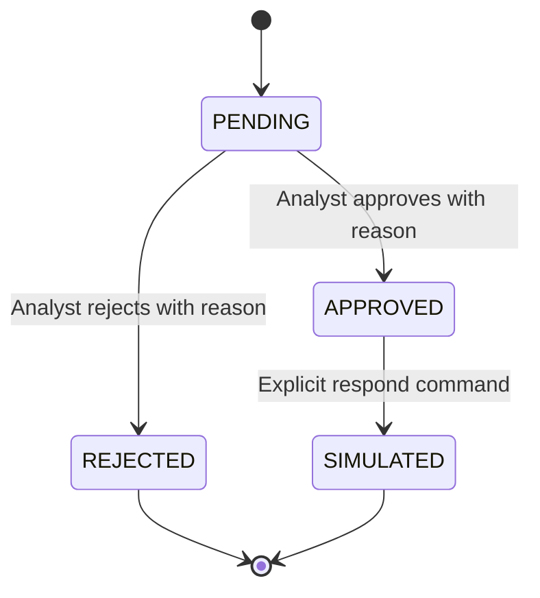

<div align="center">

# AI Cybersecurity SOC

### Follow the evidence. Explain the risk. Keep the analyst in control.

A miniature, AI-assisted Security Operations Center for defensive security education.


**Events → Detection → Correlation → Investigation → Incident → Human Approval → Response**

</div>

This lab turns five kinds of synthetic security telemetry into an explainable incident.
It normalizes evidence, applies defensive rules, correlates activity across sources,
and produces a structured investigation for analyst review. Run the entire workflow
locally with Python's standard library: no API key, cloud account, model download,
or external service is required.

The investigation layer is a **deterministic mock of AI assistance**, implemented
with templates. It demonstrates where an AI assistant could fit; it does not run an
LLM. Every response is a recorded simulation, gated by an explicit analyst decision.

> **AI assists the analyst; it does not replace human authorization for response actions.**

```text
INCIDENT #1842 · SYNTHETIC LABORATORY EXAMPLE

23 failed logins
    + successful login from an unusual documentation IP
    + viewer → admin role change
    + 500 MiB synthetic download

Risk: HIGH · 100/100 lab heuristic
Assessment: Possible credential attack; requires investigation
Response: PENDING HUMAN APPROVAL
```

## Contents

[Overview](#overview) · [Architecture](#architecture) · [Telemetry](#telemetry-sources) ·
[Normalization](#event-normalization) · [Detection](#detection-engine) ·
[Correlation](#correlation) · [Risk](#risk-scoring) · [Investigation](#ai-investigation) ·
[Incident](#example-incident-1842) · [Timeline](#investigation-timeline) ·
[Approval](#human-in-the-loop) · [Quick start](#quick-start) ·
[Configuration](#configuration) · [Structure](#repository-structure) ·
[Testing](#testing) · [Safety](#safety--scope) · [Limitations](#limitations) ·
[Roadmap](#roadmap) · [Contributing](#contributing) · [License](#license)

## Overview

A suspicious event is a starting point, not a verdict. This project teaches how
multiple signals can support a defensible investigation while keeping the evidence,
assumptions, and authorization visible.

| Implemented capability | What you can inspect |
| --- | --- |
| Five local telemetry parsers | Nginx access lines and four synthetic JSONL formats |
| Shared evidence schema | UTC timestamps, stable event IDs, identity, resource, metadata |
| Defensive rules and correlation | Failure-to-success sequence, unusual IP, privilege change, transfer size |
| Explainable prioritization | Fixed rule contributions with a 100-point cap |
| Mock investigation | Evidence references, alternative explanation, recommended checks |
| JSON incidents and timeline | Deterministic report; example starts at #1842 |
| Human review and simulated response | Approve/reject, audit history, idempotent simulation |

## Architecture



The CLI reads local files and writes a local report. There are no network collectors,
cloud integrations, real account changes, or firewall modifications.
See [architecture notes](docs/architecture.md) for component boundaries.

## Telemetry Sources

The checked-in fixtures contain **35 events**. Names such as `alex` and `jordan`
are fictional lab identities. All source addresses use documentation ranges.

| Source | File | Events | Purpose |
| --- | --- | ---: | --- |
| Nginx | [synthetic.log](data/nginx/synthetic.log) | 4 | `/login`, `/dashboard`, `/api/export` context |
| Authentication | [synthetic.jsonl](data/auth/synthetic.jsonl) | 25 | 23 failures, alex's success, jordan's benign success |
| CloudTrail-like | [synthetic.jsonl](data/cloud/synthetic.jsonl) | 2 | Synthetic object download and benign listing |
| Firewall | [synthetic.jsonl](data/firewall/synthetic.jsonl) | 2 | Allowed connection context |
| Application | [synthetic.jsonl](data/application/synthetic.jsonl) | 2 | Role change and benign page view |

**CloudTrail-like means a simplified teaching format, not actual AWS CloudTrail.**
The Nginx format places a synthetic user in the remote-user field; it is a constrained
access-log subset. It does not support arbitrary production Nginx configurations.

```text
198.51.100.42 - alex [15/Jan/2026:14:06:02 +0000] "POST /login HTTP/1.1" 200 256
```

```json
{
  "synthetic": true,
  "timestamp": "2026-01-15T14:02:11Z",
  "username": "alex",
  "source_ip": "198.51.100.42",
  "result": "failure",
  "resource": "lab-portal"
}
```

Regenerate the five named fixtures deterministically:

```bash
python scripts/generate_data.py
```

The generator overwrites those five fixture files only. The incident snapshot is
[data/incidents/incident-1842.json](data/incidents/incident-1842.json).
See [data format notes](data/README.md) before adding synthetic fixtures.

## Event Normalization

Normalization lets different sources share one evidence vocabulary. The first
authentication failure becomes the following record (stable `event_id` omitted here
for readability; complete IDs appear in the JSON report):

```json
{
  "timestamp": "2026-01-15T14:02:11.000000Z",
  "source": "auth",
  "event_type": "login_failure",
  "user": "alex",
  "source_ip": "198.51.100.42",
  "resource": "lab-portal",
  "severity": "low",
  "metadata": {}
}
```

| Field | Meaning |
| --- | --- |
| `event_id` | First 20 hex characters of SHA-256 over canonical normalized content |
| `timestamp` | Timezone-aware input converted to UTC, with six fractional digits |
| `source` | `nginx`, `auth`, `cloud`, `firewall`, or `application` |
| `event_type` | Semantic activity such as `login_success` or `privilege_escalation` |
| `user`, `source_ip` | Synthetic identity and validated documentation IPv4 address |
| `resource` | Synthetic service, bucket, or request path |
| `severity` | Informational event label; independent of incident risk |
| `metadata` | Allowlisted fields such as role transition, HTTP status, or byte count |

The loader rejects malformed records, requires every source's fixture file, sorts
by UTC timestamp and event ID, and deduplicates identical normalized evidence.
Missing JSON fields fail the run; unknown fields are dropped. Every JSON input
must declare `synthetic: true`. These checks cannot certify that user-supplied data
is actually synthetic.

## Detection Engine

The default policy is in [config/lab.json](config/lab.json).

| Rule | Condition | Lab contribution |
| --- | --- | ---: |
| `repeated_failures_then_success` | At least 20 failures strictly before success, within 600 seconds, for the same user, IP, and authentication resource | +20 |
| `unusual_login` | Successful source IP absent from that user's configured baseline | +25 |
| `privilege_escalation` | Application role changes from `viewer` to `admin` | +30 |
| `large_transfer` | Cloud-like download is at least 104,857,600 bytes (100 MiB) | +25 |

A user without a configured baseline is **unknown**, not automatically unusual.
Nginx HTTP status alone is not treated as an authentication result. Nginx and
firewall records provide context but contribute no risk points.

Repeated failures alone do not create an incident in this version. The first rule
evaluates them when a success arrives. Individual escalation or transfer signals
also do not create standalone incidents. See [rule details](docs/detections.md).

## Correlation

An incident candidate requires **both** repeated failures followed by success and
an unusual IP signal on that **same successful login**.

1. Match preceding failures by user, source IP, and authentication resource.
2. Anchor one total 600-second window at the earliest supporting failure.
3. Collect events for that user and IP inside the window, across all sources.
4. Add privilege and transfer signals only when they occur strictly after success
   and inside that total window.
5. Suppress additional candidate successes already covered by this user's/IP's window.

Resource is an exact-match key for failure-to-success authentication. Subsequent
activity may involve another resource, such as `synthetic-bucket`; that resource
remains visible in the timeline. There is no cloud-resource ownership inference.
Authentication state is represented by event order, privilege state by the explicit
role transition, and data volume by the download's byte count.

The role change and download need not be causally related. The scorer does not
require the role change to precede the download; both must follow authentication.
Shared identity, IP, and time provide investigation context, not proof of compromise.

## Risk Scoring

```text
Repeated failures followed by success    +20
Unusual successful login                 +25
Post-login privilege escalation          +30
Post-login large transfer                +25
                                        ───
Total                                    100 / 100  HIGH
```

Each rule contributes once per incident, regardless of repeated matching events.
Scores are capped at 100. `LOW` is below 40, `MEDIUM` is 40–69, and `HIGH` is 70–100.
The current candidate gate starts at 45, so generated candidates are medium or high.
This is a transparent **lab heuristic**, not a production security standard or a
probability of compromise. The report stores every factor and its supporting IDs.

## AI Investigation

`investigation_mode: "mock"` is the only implemented mode. It generates a
deterministic structured assessment from correlated signals, including:

- Signal summary and evidence IDs.
- Possible credential-attack interpretation and an authorized-exercise alternative.
- Analyst checks for authentication, configured baselines, role changes, and access.
- An explicit human-approval requirement.

The `MEDIUM` confidence value is a **fixed teaching label**, not a calibrated model
output. No prompts or telemetry leave the machine. Future AI-generated findings
would still be investigative assistance, not authoritative security determinations.
Analysts should validate the underlying telemetry before taking action.
See [investigation notes](docs/investigation.md).

## Example Incident #1842

| Incident field | Generated value |
| --- | --- |
| Category | Credential Attack Candidate |
| Identity / source | `alex` / `198.51.100.42` |
| Risk | HIGH, 100/100 |
| Investigation | Mock, MEDIUM fixed confidence label |
| Evidence | 30 timeline events; four contributing signals |
| Proposed response | `simulate_account_isolation` for `alex` |
| Status | PENDING |

The observed signals are 23 failed logins, an unusual successful login, privilege
escalation, and a 524,288,000-byte download. They share a synthetic identity and IP
within the configured time window. The mock assessment calls this a possible
credential attack and explicitly says the telemetry does not prove compromise.

**Analyst actions:** validate the source records and baseline, review the role
change and data access, and approve or reject the proposed simulation.

Read the [complete generated JSON](data/incidents/incident-1842.json) and
[actual CLI transcript](examples/demo-output.txt). Incident IDs start at 1842 for
each run and are unique within that report only; they are not GitHub issue numbers.

## Investigation Timeline

All evidence timestamps below are fixed synthetic UTC times on **2026-01-15**.

```text
14:02:11 ── First failed authentication
    …       23 failures, spaced 9 seconds apart
14:05:29 ── 23rd failed authentication
14:06:02 ── Successful authentication + Nginx POST /login
             alex · 198.51.100.42 · outside configured baseline
14:06:04 ── Nginx GET /dashboard
14:06:10 ── Firewall allowed connection to lab-portal
14:07:18 ── Application role: viewer → admin
14:09:43 ── Nginx GET /api/export
14:09:44 ── Cloud-like download: 500 MiB from synthetic-bucket
          └─ Correlated evidence → mock investigation → incident #1842
             PENDING HUMAN APPROVAL
```

The incident timeline contains evidence times, not fabricated processing times.
Review and simulation commands append actual UTC wall-clock times to a separate
`audit` list. The earlier GET `/login` at 14:02:00 is loaded but falls outside the
incident window, which begins at the first supporting failure.

## Human-in-the-Loop



There is no automatic approval. Pending and rejected incidents cannot respond.
Approval records an analyst label and reason; `respond` requires that recorded
approval. It appends a simulated account-isolation result to the report and
modifies no accounts, networks, or cloud resources. Repeating `respond` after
simulation does not append another action.

Local file access is trusted. Analyst names are self-declared; this is a workflow
gate, **not an authenticated or tamper-resistant authorization system**.

## Quick Start

Requires **Python 3.11+**. Run commands from the repository root.

```bash
git clone https://github.com/Skeeb32/AI-Cybersecurity-SOC.git
cd AI-Cybersecurity-SOC
python -m venv .venv

# macOS / Linux (use python3 above if that is your Python command)
source .venv/bin/activate
# Windows PowerShell instead: .venv\Scripts\Activate.ps1

python -m soc run
```

No dependency installation is necessary; [requirements.txt](requirements.txt)
documents the standard-library-only runtime and test suite.

Actual output from the checked-in dataset:

```text
AI CYBERSECURITY SOC — SYNTHETIC OFFLINE LAB
  application: 2 events
  auth: 25 events
  cloud: 2 events
  firewall: 2 events
  nginx: 4 events
Normalized: 35 | Signals: 4

INCIDENT #1842 — Credential Attack Candidate
Risk: HIGH (100/100)
Investigation: MOCK | Confidence: MEDIUM (fixed teaching label)
  +20: 23 failed logins followed by success
  +25: Successful login outside configured synthetic baseline
  +30: Synthetic role changed from viewer to admin
  +25: Synthetic download: 524288000 bytes
Response: PENDING HUMAN APPROVAL

Report: reports/incidents.json
```

Inspect the JSON, then record a decision and run the simulation:

```bash
python -m json.tool reports/incidents.json
python -m soc review reports/incidents.json --incident 1842 --decision approve --analyst analyst-lab --reason "Reviewed synthetic evidence for this exercise"
python -m soc respond reports/incidents.json --incident 1842
```

The last two commands print `APPROVED` and `SIMULATED`. To practice rejection on
a fresh report:

```bash
python -m soc run --output reports/rejected.json
python -m soc review reports/rejected.json --incident 1842 --decision reject --analyst analyst-lab --reason "Expected synthetic exercise"
python -m soc respond reports/rejected.json --incident 1842
```

That final command **intentionally fails** with exit code 2 and
`Error: Recorded human approval is required before simulation`.

Runs refuse to overwrite an existing report, preserving its review history. Choose
a new `--output` path for another run. A no-candidate run writes an empty incident
list and exits successfully. Invalid input exits with code 2. Use
`python -m soc --help` for command help.

## Configuration

The default [lab.json](config/lab.json) is:

```json
{
  "window_seconds": 600,
  "failure_threshold": 20,
  "large_transfer_bytes": 104857600,
  "known_ips": {
    "alex": ["192.0.2.10"],
    "jordan": ["192.0.2.20"]
  },
  "investigation_mode": "mock"
}
```

All thresholds must be positive integers. Each configured user needs a nonempty
list of documentation IPs. Unknown config keys and other investigation modes are
rejected. Risk weights remain fixed in [detection.py](soc/detection.py).

```bash
python -m soc run --data data --config config/lab.json --output reports/configured.json
```

The program does not read `.env` or require credentials. `.env`, `.env.*`, local
reports, and virtual environments are ignored by Git. Do not commit API keys,
production logs, or real personal information.

## Repository Structure

```text
AI-Cybersecurity-SOC/
├── README.md
├── requirements.txt           # No third-party runtime/test dependencies
├── config/lab.json            # Explicit baseline and thresholds
├── soc/
│   ├── __main__.py            # run / review / respond
│   ├── config.py             # Policy and documentation-IP validation
│   ├── normalization.py      # Five parsers, schema, ordering, deduplication
│   ├── detection.py          # Evidence-backed rule signals
│   ├── correlation.py        # Bounded joins and transparent scoring
│   ├── investigation.py      # Deterministic mock assessment
│   ├── incidents.py          # Pipeline and report assembly
│   └── response.py           # Approval, locking, atomic writes, simulation
├── data/
│   ├── nginx/ auth/ cloud/ firewall/ application/
│   └── incidents/incident-1842.json
├── docs/                     # Architecture, rules, investigation, safety
├── examples/demo-output.txt  # Captured CLI output
├── scripts/generate_data.py  # Deterministic fixtures
├── tests/                    # Offline unit and CLI integration tests
└── .github/workflows/tests.yml
```

## Testing

```bash
python -m unittest discover -s tests -v
```

Tests exercise parsers and normalization, invalid input, IP validation, fixture
reproducibility, replay deduplication, rule thresholds, time windows, identity and
resource separation, benign events, risk contributions, evidence references,
incident timelines, and the complete approve/reject/simulate CLI workflow. Report
locking and refusal to overwrite review history are covered too.

The GitHub Actions workflow defines a Python 3.11–3.14 test matrix. Local validation
was performed on Python 3.14; the workflow's existence is not a claim that every CI
run has passed. Documentation checks verify internal links and generated examples.
Mermaid diagrams are source diagrams, not screenshots of a dashboard.

## Safety & Scope

> [!WARNING]
> Defensive education only. Use synthetic data in a controlled local lab.
> Do not connect production infrastructure, supply real credentials or personal
> information, or use this project to facilitate unauthorized access or disruption.

- Telemetry and identities are synthetic; accepted IPs are `192.0.2.0/24`,
  `198.51.100.0/24`, and `203.0.113.0/24`.
- Investigation is advisory and mocked. Risk is a prioritization heuristic.
- Human review is required before a response simulation.
- Response code only changes the local JSON report. There is no live-response mode.
- No malware, exploits, credential theft tooling, persistence, or attack execution
  is included. See [safety notes](docs/safety.md).

## Limitations

- One small credential-attack candidate scenario; not an enterprise SIEM.
- Batch processing in memory; repeated scans are unsuitable for large datasets.
- Simplified parsers, exact user/IP joins, fixed baselines, and no session/device
  identity model. NAT, missing events, clock skew, and shared accounts can mislead.
- Identical normalized events collapse into one event, including truly distinct
  events with identical content and timestamps. IDs use truncated hashes.
- Standalone failures, role changes, and downloads do not become incidents.
- Reports have per-run sequential IDs and no durable cross-run incident database.
- Mock investigation has no learned reasoning or measured detection accuracy.
- Local review is not authenticated; report files and audit history can be edited.
  A crash can leave a lock file; see [recovery guidance](docs/safety.md).
- No dashboard, real collectors, alerts to external services, or production response.

## Roadmap

- [x] Five-source synthetic telemetry and normalization
- [x] Defensive rules, bounded correlation, and transparent risk
- [x] Mock investigation, JSON incident export, and evidence timeline
- [x] Analyst approval/rejection and simulated response
- [ ] Additional benign and ambiguous scenarios, with measured rule quality
- [ ] More efficient correlation and standalone signal triage
- [ ] Optional local-model investigation with strict structured-output validation
- [ ] Authenticated review and tamper-evident audit storage
- [ ] Local web dashboard for reviewing synthetic incidents

## Contributing

Keep changes small, defensive, and reproducible. Add synthetic fixtures and tests
for both triggering and non-triggering cases. Document the limits of new rules,
update examples when behavior changes, and run the test suite before submitting
a pull request. Do not include secrets, production logs, real targets, or offensive
payloads. Use fictional analyst labels in review examples.

## License

The repository currently has **no license file**. No open-source license or broad
reuse grant is asserted here. The repository owner should choose a license before
advertising this as licensed open-source software.
